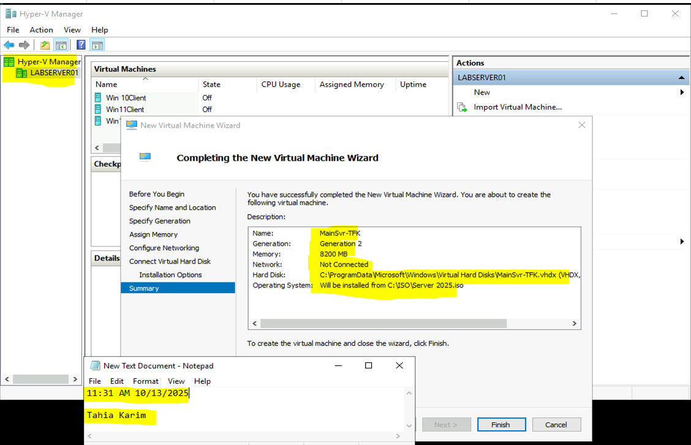
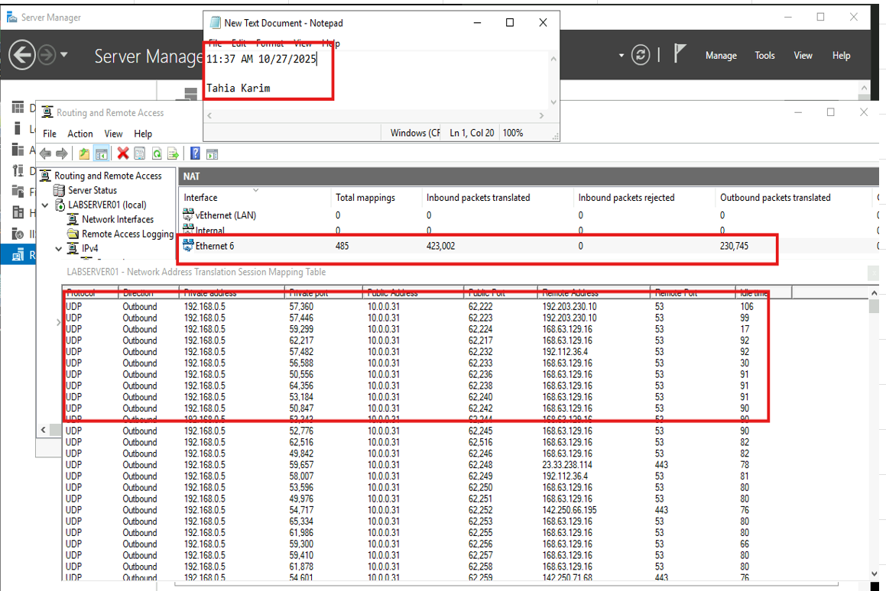
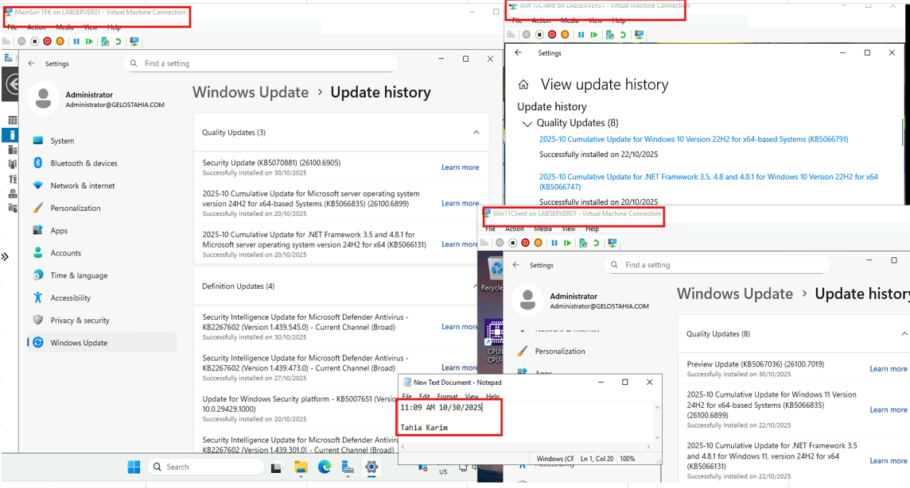
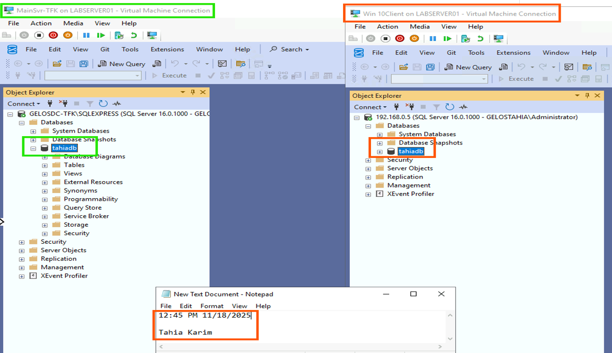
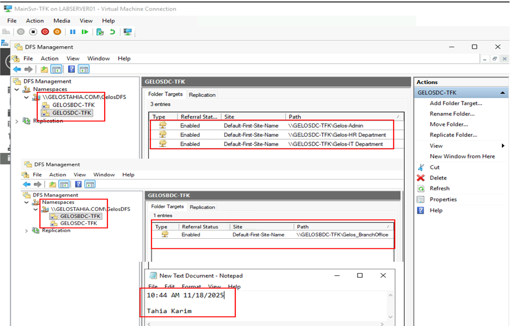
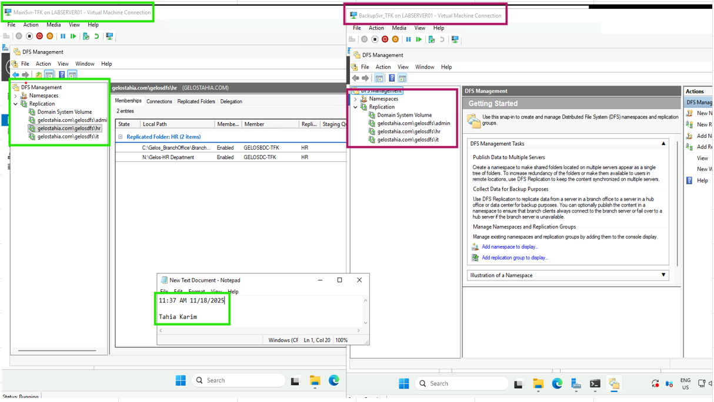
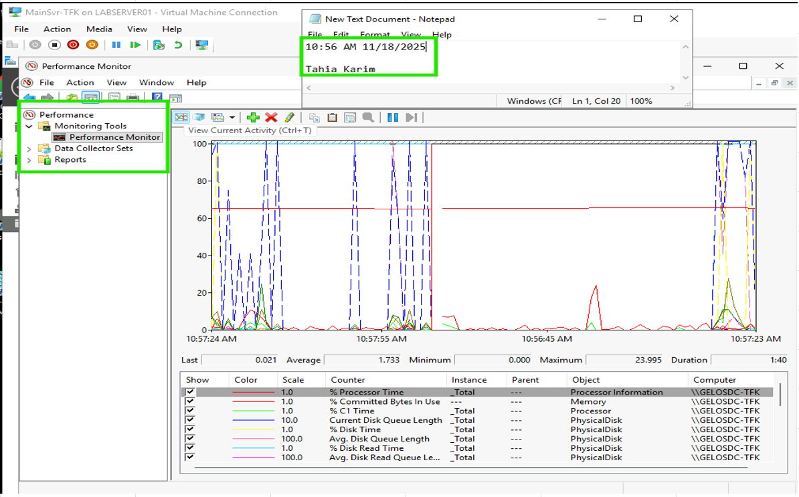

Windows Server 2025 Enterprise Infrastructure Lab (Hyper-V)

Project Overview \
This project demonstrates the design and implementation of a small enterprise IT infrastructure using Hyper-V and Windows Server 2025 Datacenter (Evaluation).\
The lab simulates a real-world corporate environment, including:
  - Virtualisation
  - Active Directory
  - File Services
  - DFS & Replication
  - NAT & Networking
  - SQL Server deployment
  - Backup & Recovery
  - Performance Monitoring

This project was built as part of my TAFE NSW Certificate IV in IT and reflects practical system administration skills.

🖥️ Environment Architecture\
Virtualisation Platform
  - Hyper-V Manager
  - Generation 2 VM
  - 8200 MB RAM
  - Windows Server 2025 Datacenter (Evaluation)

Client Machines
  - Windows 10 Client
  - Windows 11 Client

🔧 Infrastructure Implementation\
## 1️⃣ Virtual Machine Setup
  - Installed Hyper-V
  - Created Generation 2 VM
  - Allocated 8200MB RAM
  - Installed Windows Server 2025 from ISO
  - Configured server properties
  - Created VM checkpoints
  - Exported VM for full backup

### VM Installation & Server Configuration

## 2️⃣ Network Configuration & NAT
  - Configured Ethernet adapter
  - Assigned IP configuration
  - Configured NAT using Routing & Remote Access, allowing internal virtual machines to access external internet resources. 
  - Verified internet connectivity using IANA test and speed test.
  - Validated connectivity using ping between:
      - Server ↔ Windows 10
      - Server ↔ Windows 11

### NAT Configuration

## 3️⃣ Windows Updates & Patch Management
  - Checked update history
  - Installed security patches
  - Verified system security status

### Windows Update & Patch History

## 4️⃣ SQL Server Deployment
  - Installed SQL Server 2022 Express Edition
  - Configured SQL Management Studio
  - Successfully connected from Windows 10 client to the server database instance

### Remote SQL Connection from Windows 10 Client

👥 Active Directory Implementation\
Organizational Units Created
 - GelosIT
 - GelosAdmin
   
User & Group Management
 - Created user accounts
 - Assigned users to appropriate security groups
 - Applied role-based access control (RBAC)

📁 File Services & Network Shares
  - Created a dedicated data drive to configure shared folders
  - Applied NTFS permissions
  - Implemented group-based read/write access control

🌐 DFS & Replication
  - Created DFS Namespace
  - Configured DFS Replication
  - Implemented quota management
  - Validated file replication functionality

### DFS Namespace Configuration

### DFS Replication Setup

### Quota Management Configuration

📊 Monitoring & Performance
  - Used Performance Monitor to observe:
  - CPU usage
  - Memory utilization
  - Network throughput

### Performance Monitor Observation

💾 Backup & Recovery
  - Configured Windows Server Backup
  - Performed backup
  - Successfully restored the system
  - Exported full VM as recovery image

### Windows Server Backup Configuration

### Backup Restoration Validation

📌 Skills Demonstrated
  ✔ Hyper-V Virtualisation
  ✔ Windows Server Administration
  ✔ Active Directory & OU Design
  ✔ Group Policy & Access Control
  ✔ File Services & DFS
  ✔ Network Address Translation (NAT)
  ✔ SQL Server Deployment
  ✔ Backup & Disaster Recovery
  ✔ Performance Monitoring
  ✔ Troubleshooting & Connectivity Testing

📸 Screenshots\
All configuration proof and system validation screenshots are available in the /screenshots folder.

🔄 Future Improvements
  - Implement Group Policy Objects (GPO)
  - Configure WSUS
  - Implement DHCP & DNS roles
  - Set up Remote Desktop Gateway
  - Simulate domain controller redundancy
